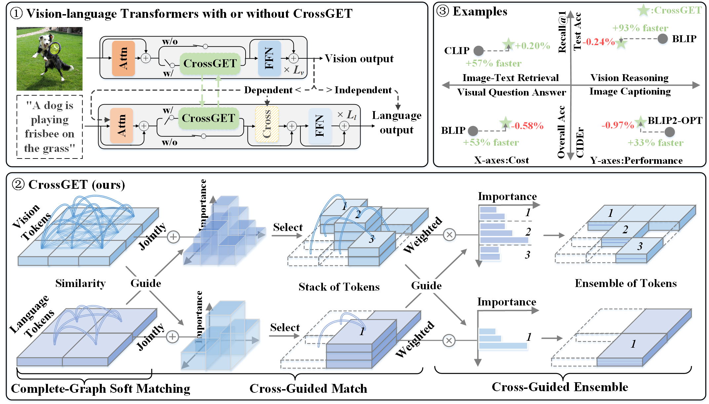

<h1>CrossGET: Cross-Guided Ensemble of Tokens for Accelerating Vision-Language Transformers</h1>

    
    
    

Official implementation of [CrossGET: Cross-Guided Ensemble of Tokens for Accelerating Vision-Language Transformers](https://arxiv.org/abs/2305.17455). Please stay tuned.
